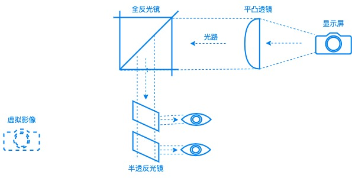
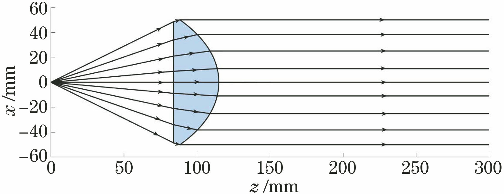
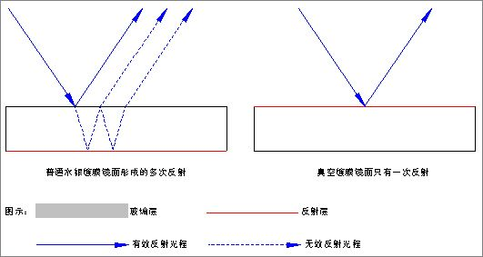
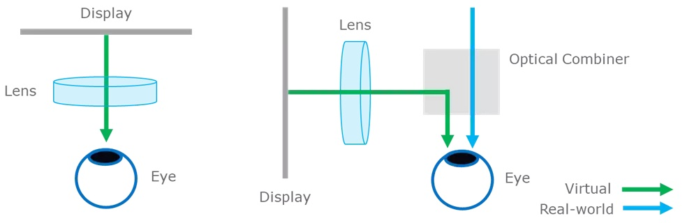
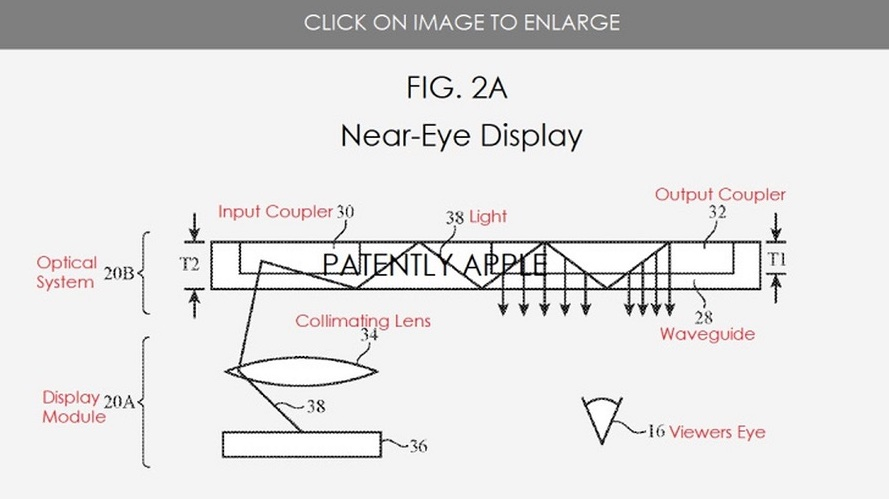
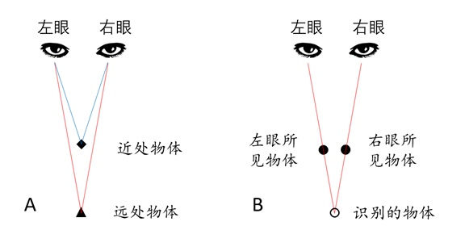

### 简介

一个`百元价位`的AR眼镜，用来学习了解AR的技术原理。基本流程：AR眼镜作为一个简单的显示设备，通过手机的`个人热点`连接到手机，然后手机通过`4G/5G`网络访问`互联网`，把需要的内容提供给AR眼镜显示出来。

AR眼镜粗略可分为几个子模块：

- 显示

	显示屏最好是既要分辨率高/亮度高/对比度高/色彩还原度高，又要体积小，还要耗电低/价格低。实际最后选择就一个：价格低...

- 光学

	

	- 平凸透镜

		原理是利用对点光源的准直`Collimating Light`特性，效果是可以避免影像重叠`Double Image Problem`。

		

		需要注意两点：
		
		- 安装时不要反了，遵循`点光对平面`：显示屏=>|平面/凸面)=>全反光镜

		- 透镜的位置：在保证显示区域的范围下尽量靠近焦点，这样准直光效果更好。但是也不能放在焦点上，否则无法成像...

	- 全反光镜

		为了避免影像重叠，最好采用单面镜`First Surface Mirrors`，而不是普通的玻璃镜`Second Surface Mirrors`。

		

	- 半透反光镜

		AR和VR的区别：AR既可以看到虚拟的影像，也可以看到真实的世界。镜片的厚度尽可能小，也可以避免重影现象。

		
		
		注意的是：每个眼镜都对应一个半透反光镜。可以通过调整两个半透反光镜的角度，让虚像重叠形成立体图像效果。如果仅仅只有一个单眼观看时，容易出现不完整的图像现象，并且没有立体效果。

	- 比较一下苹果的专利方案

		使用了光波导`Waveguide`镜片，光路的原理都是一样的（显示=>准直光=>全反光=>半透反光）。

		

		光波导集成了全反光镜和半透反光镜，同时提供了一些新特性（例如一维/二维扩瞳技术提高视场角`FOV`）。

- 算力

	计算模块提供屏幕显示/图像压缩/无线传输等各种功能。一般用嵌入式设备，这样可以按需配置算力大小，以便压缩成本/定制尺寸。

- 电力

	穿戴设备面向移动场景，对电量的需求是越大越好，尺寸越小越好。

- 外框

	主要作用是固定各个组件以及方便的佩戴，在固定组件的位置时注意保证光路的中心对齐。使用3D打印技术能极大的降低成本。

### 材料清单和价格

都是选择淘宝上可以方便买到的东西，量足价低。

| 组件 | 价格（元） | 描述 |
| --- | --- | --- |
| 显示屏 | 17 | 1.3寸IPS屏240x240像素，SPI串口，ST7789驱动 |
| 平凸透镜 | 9.9 | 直径25mm焦距90mm |
| 全反光镜 | 8.5 | 软镜子/PVC镜面 50x50cm，实际只需要4.2x4.0cm |
| 半透反光镜 | 12.5 | 用显微镜的1mm载玻片(12.5元/50片)，也可以用更薄的0.15mm盖玻片（非常脆容易碎）  |
| 算力 | 19.5 | 开发板：NodeMCU-32S兼容Arduino，芯片模组：ESP-WROOM-32E |
| 框架 | 70 | 白色树脂3D打印 |
| 杜邦线 | 2 | 母对母 40根（实际使用8根） |
| 螺丝/螺母 | 4 | 亚克力材质 3x10mm 10套 |
| 总价 | 143.4 | |

### 值得改进的地方

其实每个部分都有非常大的改进空间，当然最后就是价格赶超各款在销的AR眼镜了。这个和项目的定位`百元价位`是冲突的，所以这些改进的地方也只是说说而已，并不会真正去改进的...

- 光学显示

	- 显示屏

		更高分辨率/更小尺寸。但是价格的增加不是一点点...240x240像素1.3寸IPS屏之只要17元，1920x1080像素0.39寸的OLED屏需要300～500元

	- 光波导`Waveguide`镜片

		重量轻，而且能提供更大的FOV。在alibaba.com搜索集成了显示屏的模组，1024x768分辨率要450刀，1920x1080分辨率要680刀...

	（显示区域原理： 焦距/直径）
光学显示系统（焦距固定/FOV/亮度等）/算力

	- 3D立体

		

		人眼看到3D物体时，实际上左右眼看到的内容不一样，最后是通过大脑合成3D效果的。所以需要左右2路独立的显示模块，当然也需要更多的算力来生成相似但又有差异的画面，也需要更多的电力。
		
	- 混合现实`MR`

		大部分AR眼镜都是定焦成像，而眼睛的焦距调整范围比较广，如果看东西的焦距和眼镜的焦距差距比较大时，只能看到模糊的虚拟影像。
		
		- 可变焦距

			要清晰显示又贴近实物，就要集成可变/可调焦距的光学模块，有些类似手机/摄像机的自动对焦。

		- 眼球跟踪

			自动调焦配合眼球跟踪才能真正实现自动对焦。

	- 眼镜框

		另外树脂材料较软容易变形，可以考虑用硬度更高的尼龙材料，当然价格就要翻几倍了...

		为了方便携带，可以参考普通眼镜的结构（鼻托/耳架等）。为了美观，可以考虑加入钛合金，增加喷砂工艺，效果上升不止一个等级，当然价格也上升不止一个等级...

### 更实际一些的应用场景

**以下是纯属没有根据的瞎分析**

**主要是几点 1. 去掉内置电池 2. 有线替代无线 3. 眼镜只做显示设备，4. 算力需求移到人人都有/算力过剩的手机上。这样可以节省不少成本，也能减少体积，重量也更轻**

现在的AR眼镜价位在2～4千元，还主要是给第一批资金充足的尝鲜用户准备的。真要大规模推广，还是需要价格上相当的降低才行。所以可以考虑找一些要求不高，但是又有规模的用户场景来推广。

- 汽车HUD显示

	可玩性：有固定的电源，眼镜和手机都不需要考虑电不够的情况。而且手机作为算力来源，可玩性高太多了，手机上有非常成熟的语音控制/辅助驾驶/AR/VR等等各种现成的东西可用。

	价格：价格上应该比厂商集成的挡风玻璃（好几千）的便宜，还有一类外置的HUD价格也要500～1500。

	规模：公开市场分析估计各类的汽车HUD一年都有好几百万的销量，而且还在快速增长，还是有足够空间的

- 无人机HUD显示

	可用性：室外玩时已经带了一堆设备，无所谓多带一个高容量的充电宝了:-)
	
	价格：玩无人机的用户应该能接受稍贵一些的外设
	
	规模：估计大疆一家累计的就有几百万了吧？

